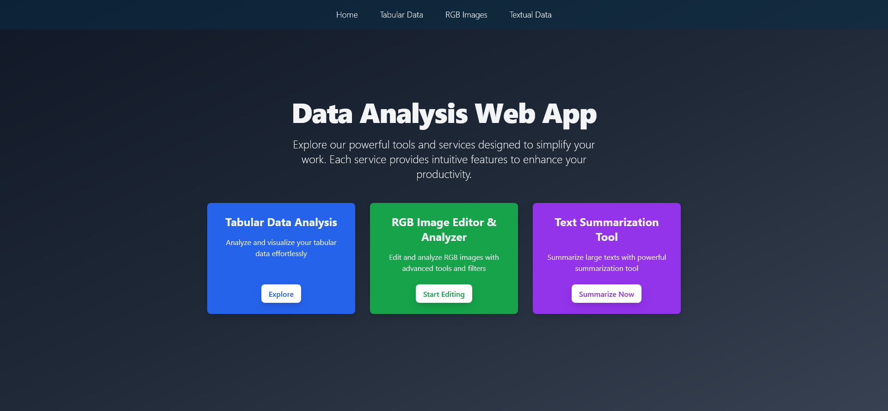
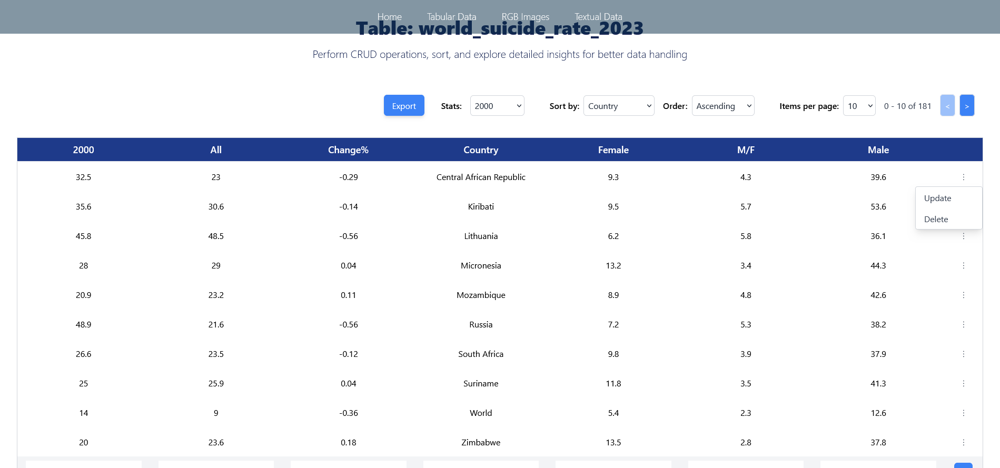
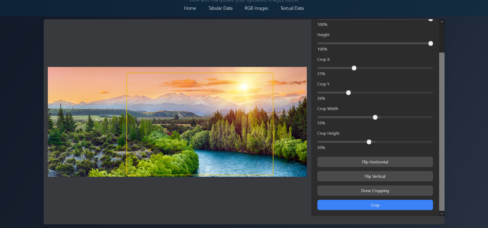

# Project Overview

This project involves creating a comprehensive full-stack application that includes features such as tabular data analysis, RGB image manipulation, and textual data analysis. It utilizes a variety of technologies and development practices to achieve a well-rounded, functional system.

#### Last Updated: August 10th, 2024

## Table of Contents

1. [Introduction](#introduction)
2. [Installation](#installation)
3. [Time Allocation](#time-allocation)
4. [Methodology](#methodology)
5. [Backend Development](#backend-development)
6. [Challenges](#challenges)
7. [Strategic Technology Choices](#strategic-technology-choices)
8. [Licensing and Intellectual Property](#licensing-and-intellectual-property)



<a name="introduction"></a>

## Introduction

This project encompasses multiple services: tabular data analysis, RGB image manipulation, and textual data analysis. It leverages React for the frontend, Flask for the backend, Backblaze B2 for image storage, SQLite3 for tabular data, and the LlamaIndex framework for text processing.


<a name="installation"></a>

## Installation

To set up and run the application, follow these instructions:

### Backend (Python)
Make sure you have [python](https://www.python.org/downloads/) downloaded if you haven't already.
Follow these steps to set up the environment and run the application:

1. **Clone the Repository:**
       
    ```bash
    git clone https://github.com/Sambonic/fullstack-analysis
    ```

2. **Create a Python Virtual Environment:**
    ```bash
    python -m venv env
    ```

3. **Activate the Virtual Environment:**
    - On Windows:
      ```
      env\Scripts\activate
      ```
    
    - On macOS and Linux:
      ```
      source env/bin/activate
      ```
4. **Ensure Pip is Up-to-Date:**
      ```
      python.exe -m pip install --upgrade pip
      ```
5. **Install Dependencies:**

   ```bash
   pip install -r requirements.txt

   ```

6. **Change Directory**
    ```bash
    cd backend
    ```
7. **Run:**

   ```bash
   python app.py

   ```
### Frontend (React)

1. **Ensure Node.js is Installed**

   - Download and install Node.js v18.70.0 from the [official website](https://nodejs.org/).

2. **Change Directory**

    ```bash
    cd frontend
    ```
3. **Install Dependencies**

    ```bash
    npm install
    ```
3. **Run:**

    ```bash
    npm start
    ```


<a name="time-allocation"></a>

## Time Allocation

Significant time was dedicated to researching technologies and libraries to ensure they met project requirements effectively and could be understood quickly within the deadline. The development phase involved building core features and iterating to refine functionalities. Testing focused on ensuring reliability through unit and integration tests. Deployment included configuring environments and preparing the application for production, ensuring a smooth transition to live operation.

<a name="methodology"></a>

## Methodology

### Incremental Development

The project followed an incremental programming approach, breaking down the work into three distinct phases:

### Project Phases

1. **Tabular Data Analysis**: Started with basic functionalities like CSV uploads and field updates. Gradually added features for sorting, statistical analysis, and exporting data.

2. **RGB Image Manipulation**: Began with fundamental image handling. Incrementally introduced batch processing, virtual editing, and popular image manipulation features such as resizing and cropping.

3. **Textual Data Analysis**: Launched with basic text processing and summarization tool using the LlamaIndex framework for effective handling of textual data.


<a name="backend-development"></a>

## Backend Development

Flask was used to manage backend services efficiently. It handled CSV uploads, data processing, and CRUD operations for tabular data. For RGB image manipulation, Flask managed uploads, storage, and transformations. In textual data analysis, Flask facilitated text summarization, keyword extraction, sentiment analysis, and T-SNE visualizations. Its flexibility and scalability were essential in building a robust backend.


<a name="challenges"></a>

## Challenges

The project faced several challenges, including managing data flow between frontend and backend, resolving a critical Node.js crash that required extensive debugging, and reworking integration logic due to limited knowledge of non-Python technologies.

<a name="strategic-technology-choices"></a>

## Strategic Technology Choices

Technologies were selected based on strategic needs: React for its dynamic and interactive frontend capabilities, Flask for efficient backend management, Backblaze B2 for straightforward image storage, SQLite3 for simple tabular data management, and LlamaIndex for effective text summarization and sentiment analysis with mid-size tokens.

<a name="licensing-and-intellectual-property"></a>

## Licensing
This project represents significant intellectual property and is shared for evaluation purposes only. It is not to be used for commercial purposes or for generating profit without explicit permission. All rights are retained by the creator.